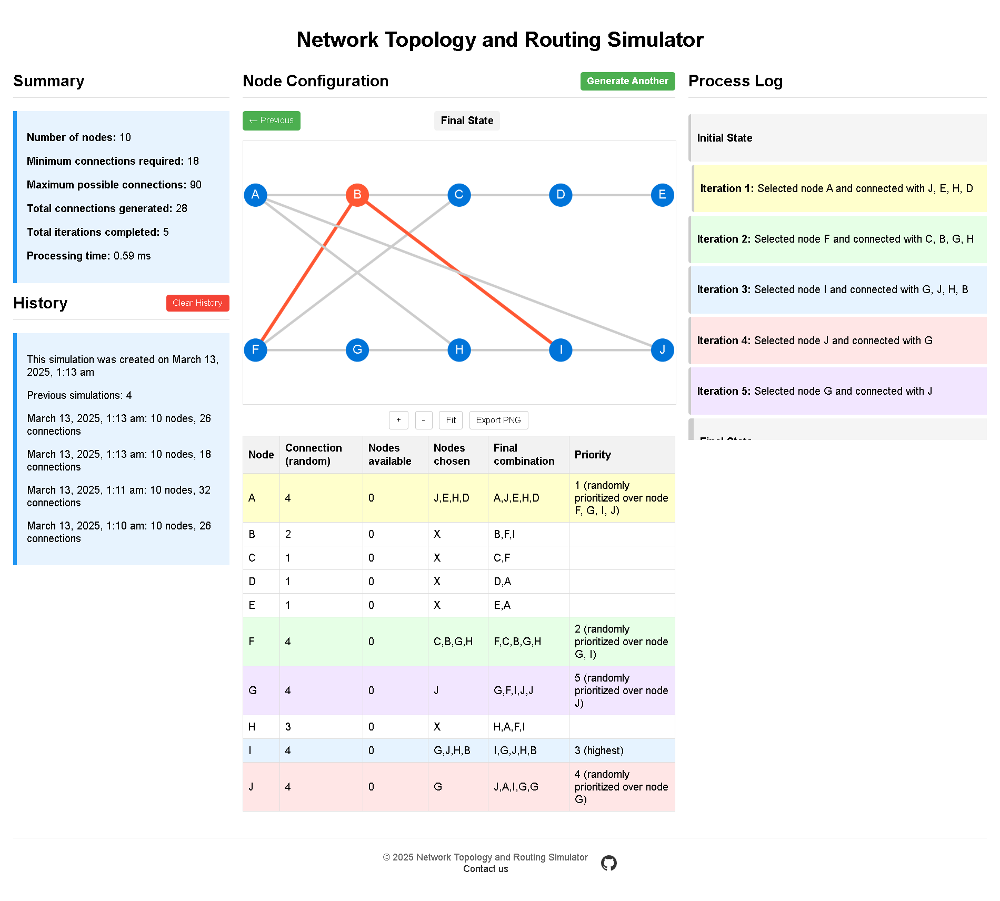

# Network Topology and Routing Simulator

## Table of Contents

- [Overview](#overview)
- [Project Structure](#project-structure)
  - [Directory Structure](#directory-structure)
  - [Development Environment](#development-environment)
  - [Production Environment](#production-environment)
- [Getting Started](#getting-started)
  - [Clone the Repository](#clone-the-repository)
  - [Setting Up the Development Environment](#setting-up-the-development-environment)
- [Production Environment](#production-environment-1)
- [Technical Details](#technical-details)
- [License](#license)

## Overview

The **Network Topology and Routing Simulator Project** uses Laravel on Docker to generate a set number of nodes in a network topology. 




## Project Structure

The project is organized as a typical Laravel application, with the addition of a `docker` directory containing the Docker configurations and scripts. These are separated by environments and services. There are two main Docker Compose projects in the root directory:

- **compose.dev.yaml**: Orchestrates the development environment.
- **compose.prod.yaml**: Orchestrates the production environment.

### Directory Structure

```
project-root/ 
├── app/ # Laravel app folder
├── ...  # Other Laravel files and directories 
├── docker/ 
│   ├── common/ # Shared configurations
│   ├── development/ # Development-specific configurations 
│   ├── production/ # Production-specific configurations
├── compose.dev.yaml # Docker Compose for development 
├── compose.prod.yaml # Docker Compose for production 
└── .env.example # Example environment configuration
```

This modular structure ensures shared logic between environments while allowing environment-specific customizations.


### Production Environment

The production environment is configured using the `compose.prod.yaml` file. It is optimized for performance and security, using multi-stage builds and runtime-only dependencies. It uses a shared PHP-FPM multi-stage build with the target `production`.

- **Optimized Images**: Multi-stage builds ensure minimal image size and enhanced security.
- **Pre-Built Assets**: Assets are compiled during the build process, ensuring the container is ready to serve content immediately upon deployment.
- **Health Checks**: Built-in health checks monitor service statuses and ensure smooth operation.
- **Security Best Practices**: Minimizes the attack surface by excluding unnecessary packages and users.
- **Docker Compose for Production**: Tailored for deploying Laravel applications with Nginx, PHP-FPM, Redis, and PostgreSQL.

This environment is designed for easy deployment to any Docker-compatible hosting platform.

### Development Environment

The development environment is configured using the `compose.dev.yaml` file and is built on top of the production version. This ensures the development environment is as close to production as possible while still supporting tools like Xdebug and writable permissions.

Key features include:
- **Close Parity with Production**: Mirrors the production environment to minimize deployment issues.
- **Development Tools**: Includes Xdebug for debugging and writable permissions for mounted volumes.
- **Hot Reloading**: Volume mounts enable real-time updates to the codebase without rebuilding containers.
- **Services**: PHP-FPM, Nginx, Redis, PostgreSQL, and Node.js (via NVM).
- **Custom Dockerfiles**: Extends shared configurations to include development-specific tools.

To set up the development environment, follow the steps in the **Getting Started** section.

## Getting Started

Follow these steps to set up and run the Laravel Docker Examples Project:

### Prerequisites
Ensure you have Docker and Docker Compose installed. You can verify by running:

```bash
docker --version
docker compose version
```

If these commands do not return the versions, install Docker and Docker Compose using the official documentation: [Docker](https://docs.docker.com/get-docker/) and [Docker Compose](https://docs.docker.com/compose/install/).

### Clone the Repository

```bash
git clone https://github.com/ulytas/pile.git
cd pile
```

### Setting Up the Development Environment

1. Copy the .env.example file to .env and adjust any necessary environment variables:

```bash
cp .env.example .env
```

Hint: adjust the `UID` and `GID` variables in the `.env` file to match your user ID and group ID. You can find these by running `id -u` and `id -g` in the terminal.

2. Start the Docker Compose Services:

```bash
docker compose -f compose.dev.yaml up -d
```

3. Install Laravel Dependencies:

```bash
docker compose -f compose.dev.yaml exec -u root workspace bash -c "chown -R www:www /var/www"
docker compose -f compose.dev.yaml exec workspace bash
composer install
npm install
npm run dev
php artisan key:generate
php artisan migrate
exit
```

4. Restart the containers:

```bash
docker compose -f compose.dev.yaml up -d
```

5. Access the Application:

Open your browser and navigate to [http://localhost](http://localhost).

## Production Environment

The production environment is designed with security and efficiency in mind:

- **Optimized Docker Images**: Uses multi-stage builds to minimize the final image size, reducing the attack surface.
- **Environment Variables Management**: Sensitive data such as passwords and API keys are managed carefully to prevent exposure.
- **User Permissions**: Containers run under non-root users where possible to follow the principle of least privilege.
- **Health Checks**: Implemented to monitor the status of services and ensure they are functioning correctly.
- **HTTPS Setup**: While not included in this example, it's recommended to configure SSL certificates and use HTTPS in a production environment.


### Deploying

The production image can be deployed to any Docker-compatible hosting environment, such as AWS ECS, Kubernetes, or a traditional VPS.

## Technical Details

- **PHP**: Version **8.3 FPM** is used for optimal performance in both development and production environments.
- **Node.js**: Version **22.x** is used in the development environment for building frontend assets with Vite.
- **PostgreSQL**: Version **16** is used as the database in the examples, but you can adjust the configuration to use MySQL if preferred.
- **Redis**: Used for caching and session management, integrated into both development and production environments.
- **Nginx**: Used as the web server to serve the Laravel application and handle HTTP requests.
- **Docker Compose**: Orchestrates the services, simplifying the process of starting and stopping the environment.
- **Health Checks**: Implemented in the Docker Compose configurations and Laravel application to ensure all services are operational.

## License

This project is licensed under the MIT License. See the LICENSE file for more details.
